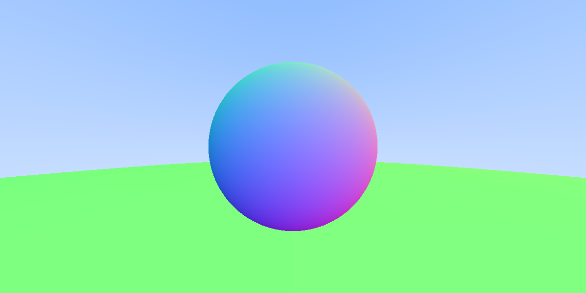

# ray-tracing
C++ Implementation of "Ray Tracing in One Weekend" by Shirley et al.

# Description
Implements a simple ray-tracer for rendering spheres of the following materials
- Lambertian (matte)
- Dielectric (glass/air/transparent depending on index of refraction)
- Metal (purely reflective with adjustable 'fuzz', effectively a mirror)

Supports user-defined camera views/intrinsic parameters, as well as two camera models:
- Pinhole (`defocus_angle <= 0`)
- Adjustable Lens (`defocus_angle > 0`)

Outputs an ASCII PPM file.

# Executable
`main.exe` compiled for Windows x86_64. Scene and output file are defined in the source code, so running `main.exe` (as compiled and uploaded to this repository) will only ever output the image shown below.

# Example Program Output

`image.png`: converted from `ppm` using nagata-yoshiteru's [pbm-ppm-pgm-viewer-for-vscode](https://github.com/nagata-yoshiteru/pbm-ppm-pgm-viewer-for-vscode).

# References
“Ray Tracing in One Weekend.” raytracing.github.io/books/RayTracingInOneWeekend.html
(accessed FEB. 03, 2025)

```bibtex
@online{Shirley2024RTW1,
   title = {Ray Tracing in One Weekend},
   author = {Peter Shirley, Trevor David Black, Steve Hollasch},
   year = {2024},
   month = {August},
   url = {https://raytracing.github.io/books/RayTracingInOneWeekend.html}
}
```